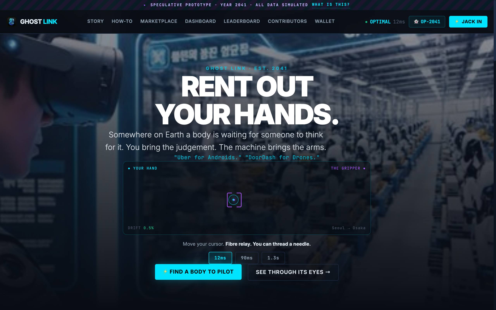
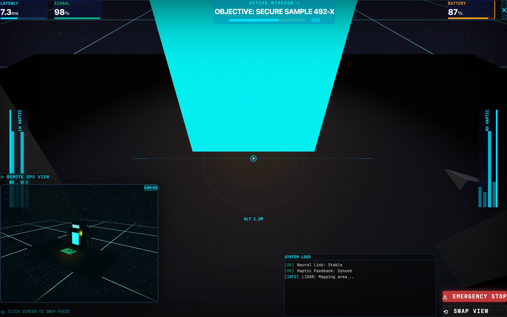
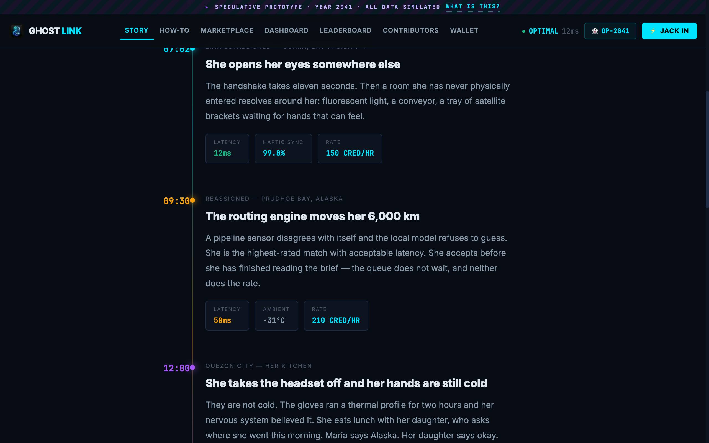
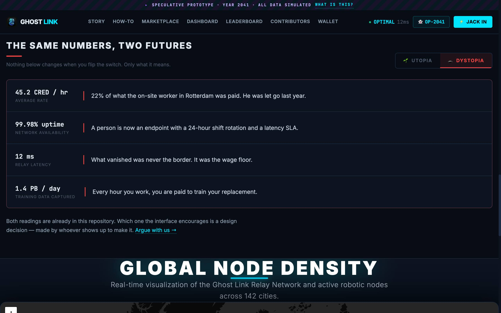

# 👻 Ghost Link

> **The dashboard for a job that doesn't exist yet.**

**[ghostlink.work](https://ghostlink.work/)** · open source · MIT



---

## ⚠️ Read this first

**There is no company. There is no token. There are no robots.**

Ghost Link is *design fiction*: a working prototype of the interface millions of
people would use if they piloted robot bodies for a living. Every number on the
site is invented, and the site says so on every page.

The hardware isn't here. The economy isn't here. **So we're building the
interface first**, in the open, so that when it arrives we set the standard
instead of inheriting one.

## 🔮 The premise

One day a surgeon in Tokyo repairs a pipeline in Alaska. A gamer in Brazil runs a
construction bot on the Moon. Someone in Manila earns six times the local wage
without leaving the city her daughter sleeps in — and someone in Rotterdam loses
the job she is doing.

Both of those sentences are true at once. **The interface decides which one you
see.** That decision is the thing this repo is arguing about.

## 🖥 What's built

| | |
|---|---|
| **[/](https://ghostlink.work/)** | Landing. Move your cursor — the gripper follows you exactly 12 ms late. Try the 1.3 s Earth→Moon setting. |
| **[/story](https://ghostlink.work/story)** | One operator's shift, 06:40 to 21:00. The most important page here. |
| **[/vr](https://ghostlink.work/vr)** | The cockpit: live telemetry, dual camera feeds, haptic readouts, an emergency stop that really stops. |
| **[/marketplace](https://ghostlink.work/marketplace)** | Job listings — and who is on the other end of them. |
| **[/dashboard](https://ghostlink.work/dashboard)** | Earnings, proficiency matrix, rank. |
| **[/contributors](https://ghostlink.work/contributors)** | The one page that is real: live from the GitHub API. |


*`/vr` — first visit walks you through what each readout means.*


*`/story` — the concept as a life, not a feature list.*


*The landing page ships both readings of its own premise, on a switch.*

## 🚀 Run it

```bash
git clone https://github.com/EtainClub/ghost-link.git
cd ghost-link
pnpm install
pnpm dev            # http://localhost:3000
```

```bash
pnpm build          # production build
pnpm start          # serve the build
pnpm lint
```

No env vars, no database, no API keys.

## 🛠 Contribute

**We don't need optimised SQL. We need screens that don't exist yet.**

1. **Build a screen.** A dispute panel. A consent flow for a shell working in
   someone's living room. A shift handover. Every page is one file in `app/`.
2. **File an incident from 2041.** There's an
   [issue template](https://github.com/EtainClub/ghost-link/issues/new/choose)
   with fields for operator ID and latency. The field that matters is *"what the
   interface should have done."*
3. **Vibe code.** Point Claude/Cursor/Copilot at a page and ask for something
   wilder. Submit the PR.

Read **[CONTRIBUTING.md](CONTRIBUTING.md)** — five minutes to your first PR, plus
the one house rule (nothing that would function as a real solicitation).

The current diagnosis of what this site communicates badly, and the plan for
fixing it, lives in
**[docs/CONCEPT-IMPROVEMENT.md](docs/CONCEPT-IMPROVEMENT.md)**. Disagreeing with
it is a good first issue.

## Stack

Next.js 16 (App Router) · TypeScript · React Three Fiber · Leaflet · vanilla CSS
with design tokens in `app/globals.css` · pnpm · deployed on Vercel

---

> *"The future is already here — it's just not evenly distributed."*
>
> **Star this if you want a say in how it gets distributed.** 🌟
